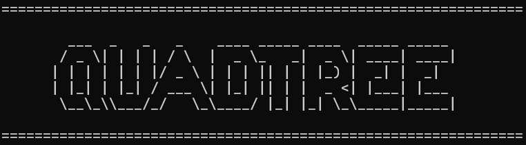

# Kompresi Gambar Dengan Metode Quadtree



## Deskripsi Singkat

Program ini mengimplementasikan algoritma kompresi gambar berbasis **Quadtree**, yaitu metode segmentasi citra yang membagi citra menjadi blok-blok berdasarkan kompleksitas nilai piksel. Program ini:
- Mendukung 4 metode pengukuran error: Variance, MAD (Mean Absolute Deviation), Max Diff, dan Entropy.
- Memberikan opsi untuk menentukan nilai threshold, ukuran blok minimum, dan target kompresi.
- Menyimpan hasil kompresi sebagai file gambar baru.

## Requirements & Instalasi

- **Bahasa:** C++
- **Compiler:** GCC / MinGW / Clang (support C++11 ke atas)
- **Dependensi:** 
  - `stb_image.h` dan `stb_image_write.h` (sudah disertakan)
- Tidak memerlukan library eksternal lain.

## Instalasi & Kompilasi

### 1. Clone Repositori
```bash
git clone https://github.com/Rusmn/Tucil2_13523068_13523110.git
cd Tucil2_13523068_13523110
```

### 2. Kompilasi & Jalankan

### 1. Menggunakan Makefile (Linux/macOS)

Langkah-langkah:
```bash
# Compile program
make

# Jalankan program setelah kompilasi
make run

# Hapus file hasil kompilasi
make clean
```

> File executable akan dihasilkan di folder `bin/` dengan nama `main`.

### 2. Menggunakan compile.bat (Windows)

Langkah-langkah:
1. Buka Command Prompt di direktori utama proyek.
2. Jalankan perintah berikut:
```cmd
.\compile.bat
```

3. File hasil kompilasi akan tersimpan di:
```
bin\main.exe
```

4. Untuk menjalankan program:
```cmd
bin\main
```

### 3. Manual Compile (opsional)

```bash
g++ src/main.cpp src/quadtree.cpp src/image_utils.cpp src/error_metrics.cpp -o bin/main
```

## Cara Menjalankan & Menggunakan
(Selain kompilasi manual, langsung langkah 2)

1. Jalankan file hasil kompilasi (dari folder `bin/`):
    ```bash
    ./bin/main
    ```

2. Ikuti petunjuk input:
    - Masukkan nama file input (misal: `input.jpg`)
    - Pilih metode error:
      ```
      1. Varian
      2. MAD
      3. Max Diff
      4. Entropi
      ```
    - Masukkan threshold, ukuran blok minimum, dan target kompresi
    - Masukkan nama file output (contoh: `output.png`)

## Struktur Direktori

```
.
├── bin/
│   └── main                        # Output executable (Linux/macOS & Windows)
├── src/
│   ├── .vscode/
│   ├── error_metrics.cpp/.hpp
│   ├── image_utils.cpp/.hpp
│   ├── quadtree.cpp/.hpp
│   ├── stb_image.h
│   ├── stb_image_write.h
│   └── main.cpp
├── test/
│   ├── input.jpg                   # Contoh input (disediakan manual)
│   └── output.png                  # Hasil kompresi
├── doc/                           
├── compile.bat
├── Makefile
└── README.md
```

## Author

| NIM       | Nama                        |
|-----------|-----------------------------|
| 13523068  | Muh. Rusmin Nurwadin        |
| 13523110  | Andrew Isra Saputra DB      |
